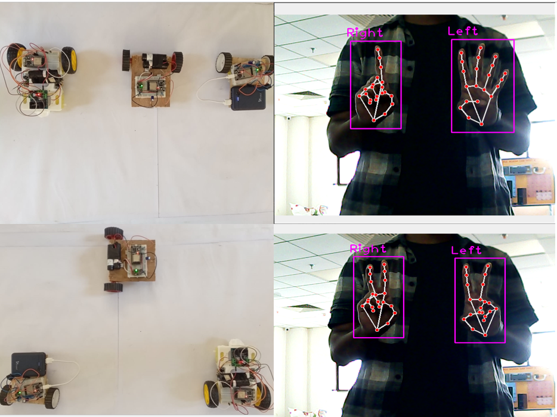
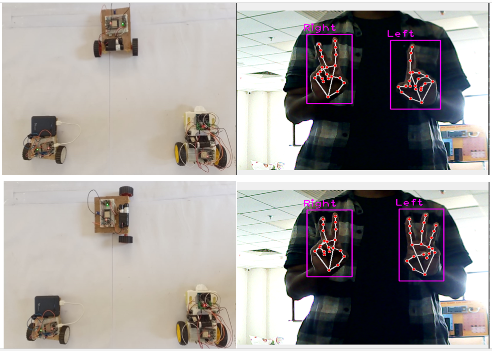
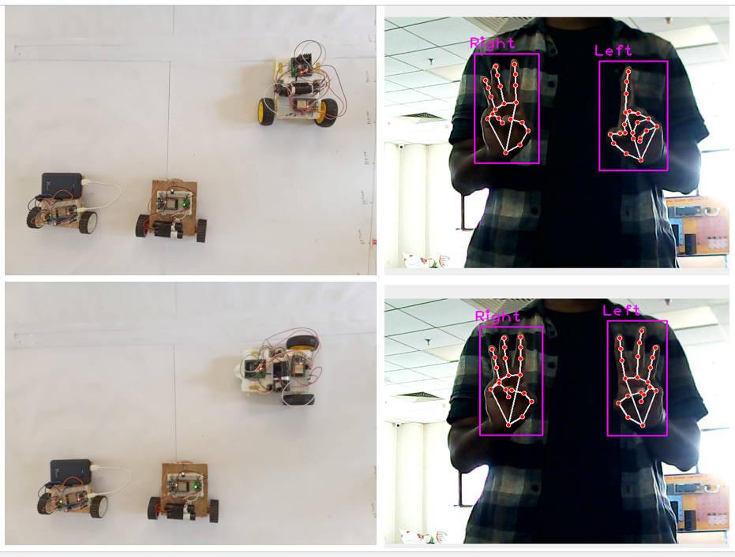
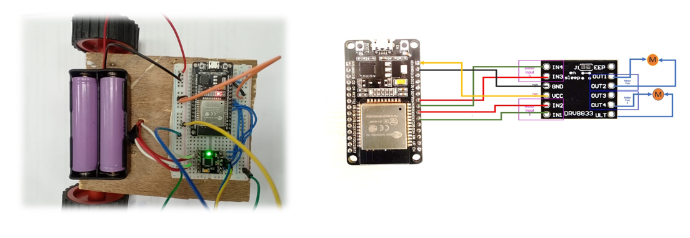

# Real-Time Control of Multiple Robots using Hand Gestures

This project is aimed at developing a real-time control system for multiple robots using hand gestures. The system is designed to be user-friendly and intuitive, allowing users to control multiple robots simultaneously using simple hand gestures.

# Table of Contents
- [Real-Time Control of Multiple Robots using Hand Gestures](#real-time-control-of-multiple-robots-using-hand-gestures)
- [Table of Contents](#table-of-contents)
  - [Demonstration of the project](#demonstration-of-the-project)
    - [Photos of the project](#photos-of-the-project)
    - [Video of the project](#video-of-the-project)
  - [Features](#features)
  - [Circuit Design](#circuit-design)
  - [Installation](#installation)
  - [Usage](#usage)
  - [Contributing](#contributing)

## Demonstration of the project

### Photos of the project
<!--  -->

<!--  -->

### Video of the project

## Features

The system includes the following features:

- Real-time control of multiple robots using hand gestures
- Intuitive and user-friendly interface
- Support for multiple robots
- Customizable gestures for controlling different actions
- Robust and reliable communication protocol
- Efficient use of system resources

## Circuit Design

List of the components used -
1. ESP32 microcontroller
2. DRV8833 motor driver
3. Jumper wires
4. 2 wheels 

## Installation

To install the system, follow these steps:

1. Clone the repository to your local machine using `git clone https://github.com/username/project-name.git`.
2. Install the required dependencies using `pip install -r requirements.txt`.
3. Compile and upload the `robot.ino` on your mobile robot.
4. Connect the robots to the system using the specified protocol.

## Usage

To use the system, follow these steps:

1. Run the system using `python main.py`.
2. Use the specified hand gestures to control the robots.
3. Monitor the robots' movements and actions in real-time using the system's interface.

## Contributing

If you would like to contribute to the project, please follow these guidelines:

1. Fork the repository to your own GitHub account.
2. Create a new branch for your changes using `git checkout -b my-feature-branch`.
3. Make your changes and commit them using `git commit -m "Add my new feature"`.
4. Push your changes to your branch using `git push origin my-feature-branch`.
5. Open a pull request on the original repository and wait for review.